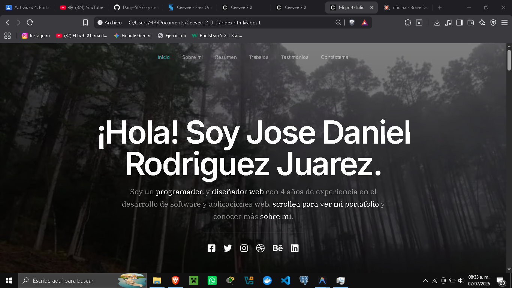
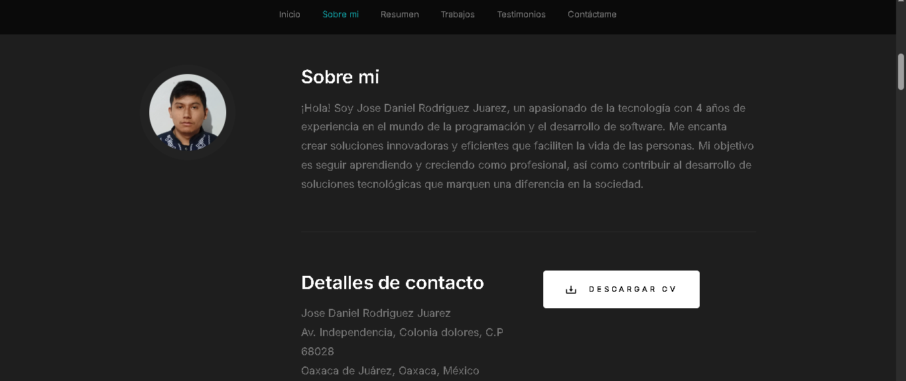
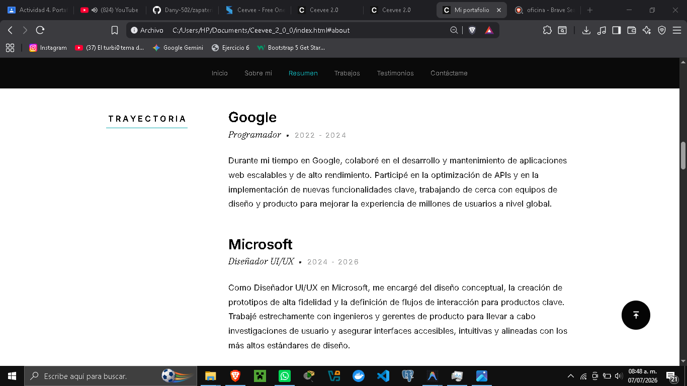
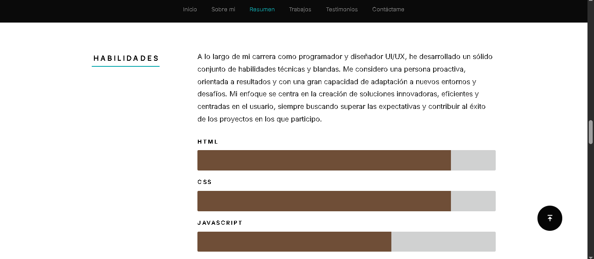
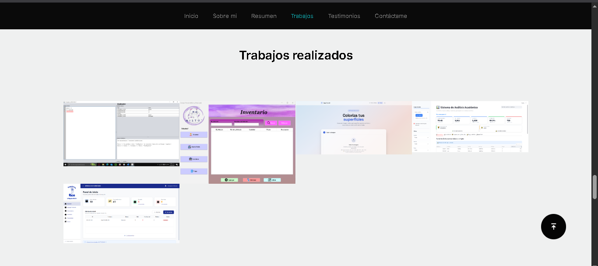
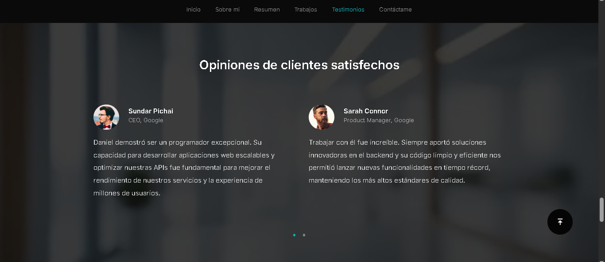
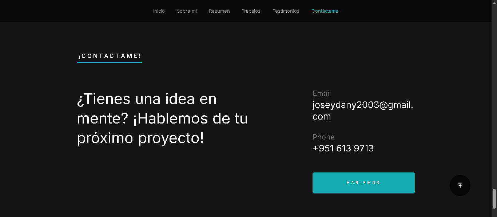

# Portafolio Personal  

* **Institución:** Instituto Tecnológico de Oaxaca
* **Carrera:** Ingeniería en Sistemas Computacionales
* **Materia:** Programación Web
* **Estudiante:** Rodriguez Juarez Jose Daniel
* **No.Control:** 22161222
* **Grupo:** 7SC
* **GitHub Pages:** https://dany-502.github.io/Portafolio-profesional_Plantilla/

## Descripción Breve
Este es mi portafolio web personal, el cual describe mis habilidades, experiencia y proyectos que realice/colabore , soy un profesional enfocado en la Programación y el Diseño UI/UX. El portafolio está diseñado para destacar mi experiencia laboral, mi formación académica, mis habilidades técnicas y una galería interactiva de los proyectos que he desarrollado.

---

## Detalles Técnicos del Proyecto

- **Framework CSS:** Este portafolio emplea un sistema de cuadrícula (Grid) personalizado y estilos CSS puros (Vanilla CSS) estructurados para ser altamente responsivos y modulares.
- **Plantilla Base:** Se utilizó la plantilla **"Ceevee 2.0"** (Versión 2.0.0).
- **Enlace de la Plantilla:** [StyleShout - Ceevee Template](https://www.styleshout.com/free-templates/ceevee/)

### Menús y Secciones del Portafolio

El portafolio se compone de una sola página con navegación fluida entre las siguientes secciones:

1. **Inicio (`#hero`):** La sección principal de bienvenida con el nombre, título profesional y un resumen muy breve del perfil. Incluye enlaces a redes sociales y un botón para deslizarse hacia la siguiente sección.
2. **Sobre mí (`#about`):** Una breve biografía personal y profesional, junto con los datos de contacto directos y un botón para descargar el currículum vitae (CV).
3. **Resumen (`#resume`):** Detalla la trayectoria profesional. Se divide en tres subsecciones:
   - **Educación:** Historial académico 
   - **Trayectoria (Experiencia Laboral):** Roles desempeñados en Google y Microsoft con descripciones de logros.
   - **Habilidades (Skills):** Barras de progreso visuales que indican el nivel de dominio en diferentes tecnologías y herramientas.
4. **Trabajos (`#portfolio`):** Una galería interactiva de proyectos destacados. Al hacer clic en cada proyecto, se abre una ventana emergente (modal) con una captura detallada, descripción técnica y el enlace al proyecto.
5. **Testimonios (`#testimonials`):** Un carrusel interactivo con citas y recomendaciones de colegas o líderes con los que he trabajado (enfocados en mis habilidades de programación y diseño).
6. **Contáctame (`#contact`):** Formulario e información final de contacto (correo y teléfono) para oportunidades laborales o colaboraciones.

---

## Proceso de Creación y Modificaciones

El portafolio se construyó partiendo de la plantilla Ceevee 2.0. Para adaptarla a las necesidades específicas de mi perfil, se realizó el siguiente proceso paso a paso:

### 1. Traducción y Personalización Básica
- Se tradujo toda la estructura de la página (menús, encabezados de secciones, etiquetas) del inglés al español.
- Se actualizó la información de los metadatos y el título de la página web.
- Se integró la información personal, la educación y la experiencia laboral específica en Google y Microsoft.

### 2. Correcciones Técnicas
- Se solucionaron errores de sintaxis HTML5 en el archivo `styles.html` (etiquetas `<svg>` mal cerradas y reemplazo del atributo obsoleto `frameborder` por estilos CSS en etiquetas `<iframe>`).

### 3. Modificación de Secciones y Contenido
- **Sección Resumen:** Se redactaron descripciones profesionales y detalladas para justificar el trabajo realizado como Programador en Google y como Diseñador UI/UX en Microsoft.
- **Sección Testimonios:** 
  - Se eliminaron testimonios genéricos o irrelevantes (como menciones a Apple y Amazon).
  - Se redactaron 4 nuevos testimonios enfocados en validar mis dos perfiles profesionales: dos enfocados en mis habilidades de código/backend en Google, y dos enfocados en mis habilidades de diseño de interfaces en Microsoft.
  - **Ajuste del Carrusel (Swiper JS):** Al haber solo 4 testimonios, el carrusel de SwiperJS generaba la ilusión visual de que se repetían los slides del medio. Se modificó el archivo `js/main.js` para añadir la propiedad `slidesPerGroup: 2`, asegurando que la navegación en pantallas grandes avance de dos en dos sin repeticiones.
- **Limpieza:** Se eliminó la sección "Call To Action" original de la plantilla que promocionaba servicios de hosting web, ya que no aportaba valor a mi portafolio.

### 4. Integración del Portafolio de Proyectos (Galería)
- Se reemplazaron las imágenes de marcador de posición de la plantilla por las capturas de pantalla reales de los proyectos del usuario ubicadas en la carpeta `images/portfolio/gallery/`.
- Se configuraron los 5 proyectos reales en los que he trabajado: *Analizador Sintáctico, Mercado Mitsu, Sayer Vision, Sistema Análisis* y *Zapatería Ríos*.
- Se arregló un problema donde las imágenes no se mostraban dentro de los popups modales corrigiendo las rutas de las etiquetas ``.
- Se redactó una descripción y se asignaron categorías específicas para cada uno de los 5 proyectos en sus respectivos modales.

### 5. Ajustes de Diseño (CSS)
- **Barra de Navegación:** Se cambió el color del botón activo (el que indica en qué sección estás) en la barra superior. Originalmente era naranja (`var(--color-2)`), y se modificó para que use el verde azulado (`var(--color-1)`), alineándose con el color primario del tema.
- **Barras de Habilidades:** Se modificó el archivo `styles.css` para cambiar el color de relleno (fondo) de la barra de progreso de las habilidades a un elegante tono café (`#6F4E37`).

---

## Capturas de Pantalla

### Inicio 

### Sobre Mí

### Resumen

#### Trayectoria Profesional

#### Habilidades

### Portafolio de Trabajos 

### Testimonios

### Información de Contacto

